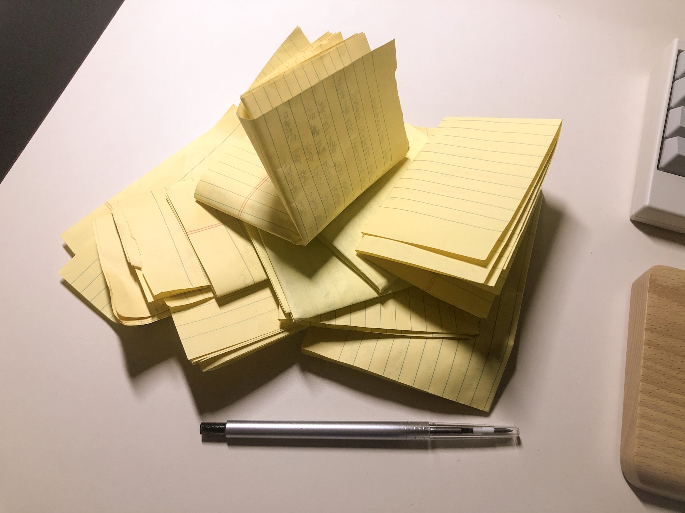

<a href="https://pixabay.com/ko/?utm_source=link-attribution&amp;utm_medium=referral&amp;utm_campaign=image&amp;utm_content=1857175">Pixabay</a>로부터 가져온 <a href="https://pixabay.com/ko/users/3844328-3844328/?utm_source=link-attribution&amp;utm_medium=referral&amp;utm_campaign=image&amp;utm_content=1857175">Lorenzo Cafaro</a>님의 이미지 입니다.

## 두루뭉술한 진술은 번복할 수 있다.

그림을 그리든 프로그램을 작성하든 내가 말들 결과물에 대한 구체적인 그림이 있어야 한다. 그렇지 않고 막연히 다른 자료를 참조해서 똑같이 따라한다면 그 것은 전부 부채로 남는다. 따라서 어떤 목적을 이루기 위해서는 가능한 모든 노력을 기울여서 상황을 구체적으로 정의하고 발생 가능한 결과를 예측해야 한다. 이것은 비단 한 분야에 대한 것이 아니다. 모든 분야에서 통용되는 이야기 이다. 개발을 할 때에도 당장 눈앞의 문제를 해결하기 위해 검색한 결과를 그대로 사용하면 반드시 문제가 생긴다. 운동도 무작정 따라하다보면 몸에 탈이 나기 마련이다. 그래서 시작하기 전에 눈을 감고 떠올려보는 것이다. 그리고 그것을 말 또는 글로 옮겨본다. 그렇게 하면 생각했던 것이 얼마나 구체적이고 정확한지 알 수 있다.

## 상황에 맞는 글쓰기

글을 목적에 따라 다른 방식으로 쓰여진다. 자신의 의견을 주장하는 글, 새로운 기술을 설명하는 글, 내 감정을 표현하는 글 등 매우 다양하다. 이중에는 막연히 써내려가는 글도 있지만 형식을 갖추고 이야기를 구조에 맞추어 써 내려가는 글도 있다. 기술에 관한 글이 특히 그러하다.

어떻게 하면 글을 잘 쓸 수 있을까? 글을 쓰는 단계부터 독자가 읽을 후 반응 까지 각 부분마다 배울점이 있다. 앞서 말했듯 내가 무엇을 쓸 지 누가 읽을지 어떤 목적을 가지고 글을 쓸지 명확히 정의하고 글을 작성하는 것이 첫번째이다. 그 다음으로는 구정에 맞추어 쓰면서 상황에 따라 사진, 영상, 표 등을 효과적으로 활용하는 것이다. 마지막으로는 내가 고려한 독자층이 이 글을 읽고 원하는 것을 얻었는지 알아보는 것이다. 단순히 정리했지만 세부적으로 들어가면 모든 습관 하나하나를 바로잡고 노력해야 한다. 결국 내가 해야할 것은 한번에 얻어지는 행운이 아니라 무엇을 할 지 의식하고 그것을 꾸준히 해나가는 것이다.

## 머리속으로 떠올린 생각을 아주 간단히 정리해보기

생각은 고차원적이다. 앞, 뒤도 없고 위, 아래도 없다. 모든 방향으로 나아갈 수 있는게 생각이다. 그렇기 때문에 자유롭지만 오히려 그것 때문에 흔적을 남기기 힘들다. 생각을 실재로 만드려면 말로 표현하는 방법과 글로 쓰는 방법이 있다. 우선, 생각을 자유롭게 글로 표현한다. 형식을 상관이 없다. 그림일수도 글일 수도 아니면 시 일 수 도 있다. 그리고 그것을 압축하고 줄이고 방향을 정해서 딱 한가지로 정리하는 것이다. 그러면 출발이 어찌 되었든 결과물이 나온 것이고 그 생각을 한번 매듭지을 수 있다.

