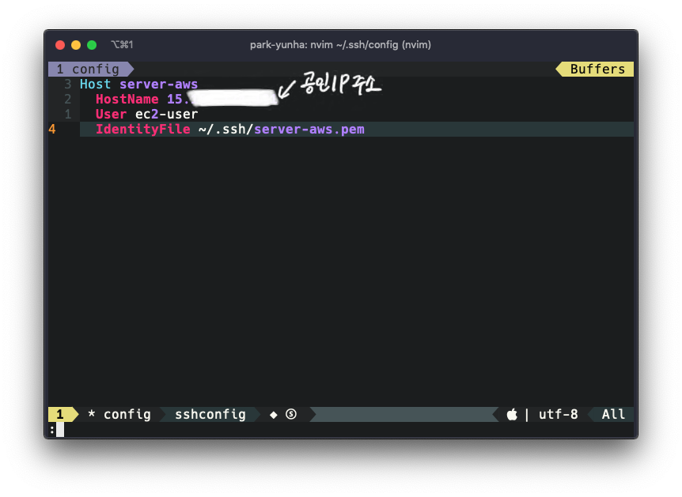



## SSH는 언제 사용을 할까?

**AWS**나 **GCP**와 같은 클라우드 서비스를 이용한다면 아마 대부분 서버 인스턴스를 사용하고 있을 것이다. 그리고 그 서버에 서비스가 구동중이거나 구동할 예정이라면 개발자는 꽤 자주 원격으로 서버에 접속해야할 것이다. 보통 클라우드 벤더들은 웹 환경에서 쉘을 접속할 수 있도록 하거나 구글 같은 경우 [Cloud SDK](https://cloud.google.com/sdk/?hl=ko)를 설치하면 자신들이 만든 명령어로 접속할수 있다. 하지만 일반 서버에 접속하거나 AWS를 이용한다면 대부분 **SSH**를 이용해야 한다.


[SSH](https://ko.wikipedia.org/wiki/시큐어_셸)는 멀리 떨어진 다른 컴퓨터에 접속하여 명령을 실행할수 있도록 해주는 응용 프로그램 또는 그 프로토콜을 말한다.


대부분의 사용자가 윈도우 환경 혹은 맥 환경에서 컴퓨터를 사용하기 때문에 이 두 OS에서 대표적인 클라우드 서비스인 AWS의 [EC2서버](https://aws.amazon.com/ko/ec2/)에 원격접속하는 방법에 대해 알아보자.

## Contents

1. SSH 접속하기
2. macOS에서 SSH config 설정하기
3. Windows 10에서  SSH config 설정하기

## SSH 접속하기

1. SSH 클라이언트를 연다.(윈도우의 경우는 [Cmd](https://ko.wikipedia.org/wiki/Cmd.exe) 혹은 [Git bash](https://gitforwindows.org), 맥의 경우는 [터미널](https://support.apple.com/ko-kr/guide/terminal/welcome/mac))
2. 프라이빗 키 파일(`server.aws.pem`)을 찾는다.
3. SSH를 사용하기 위해 키 파일의 권한을 변경해준다.
`chmod 400 server-aws.pem`
4. 퍼블릭 DNS 또는 IP를 사용하여 인스턴스에 연결한다.



원격 서버에 접속하기 위해서는 서버에서 접속하는 클라이언트에 대해 접근이 **허가**되어야 한다. 예를 들어 아마존의 EC2 인스턴스의 경우 [보안 그룹](https://docs.aws.amazon.com/ko_kr/AWSEC2/latest/UserGuide/using-network-security.html)을 구성하여 인스턴스에 대한 트래픽을 제어할 수 있다. 따라서 외부에서 접속하기 위해 특정 IP 대역에 대해 SSH 접근을 허용해줘야 한다.


## macOS

맥의 경우 잘 알려져 있다시피 운영체제가 유닉스 기반으로 만들어졌다. 그러다보니 개발에 필요한 여러 툴들이 기본적으로 설치되어 있기도 하고 설치가 매우 간편하다. SSH는 기본적으로 설치되어 있으므로 바로 SSH 설정파일을 작성하도록 하자.

### SSH 설정파일 만들기

맥 환경에서는 기본적으로 SSH가 설치 되어 있기 때문에 아래와 같이 설정을 진행하면 된다.

#### 홈 디렉토리로 이동

`cd ~`

#### .ssh 디렉토리에 `config` 파일 생성

`vim ~/.ssh/config`

#### 접속할 호스트 정보 입력

AWS EC2를 접속할 때는 **비밀번호**를 이용하는 것과 **키 파일**을 이용하는 2가지 방법이 있다.

1. 비밀번호를 이용한 접속 방법

```vim
Host 호스트명
    HostName 호스트IP
    User 호스트사용자명
```

2. 키 파일(pem)을 이용한 접속 방법

`IdentityFile` 항목을 추가해서 키 파일(pem) 위치를 입력해준다.

```vim
Host 호스트명
    HostName 호스트IP
    User 호스트사용자명
    IdentityFile pem키위치
```



위의 캡쳐와 같이 설정하면 이제부터는 `config`에 설정해둔 호스트 명칭(`ssh server-aws.pem`)을 입력하는 것만으로도 쉽게 서버에 접속할 수 있다.

## Windows 10

윈도우 7 이전의 경우 운영체제에서 기본적으로 SSH 접속을 지원하지 않기 때문에 [putty](https://www.putty.org/)와 같은 툴을 사용하여 접속하는 경우가 많았다. 하지만 [윈도우 7 지원](https://support.microsoft.com/ko-kr/help/4057281/windows-7-support-will-end-on-january-14-2020)이 2020년 1월 14일자로 종료되기 때문에 윈도우 10 기준으로 진행하도록 하겠다.

윈도우 10도 맥과 마찬가지로 SSH가 기본적으로 설치 되어 있기 때문에 SSH 설정파일을 바로 작성해주면 된다. 위에서 언급한 것처럼 기본적으로 제공되는 [Cmd](https://ko.wikipedia.org/wiki/Cmd.exe)나 [PowerShell](https://docs.microsoft.com/ko-kr/powershell/scripting/getting-started/getting-started-with-windows-powershell?view=powershell-6)을 사용해도 되고 [Git bash](https://gitforwindows.org)를 설치하여 활용해도 된다. 개발을 위해서는 서버와 비슷한 환경을 사용할 수 있는 Git bash를 사용하는 것을 추천한다. 명령어 뿐만 아니라 테마 설정 등 개발자 편의를 누릴 수 있는 기능들을 제공하기 때문이다.

### SSH 설정파일 만들기


접속 시도 중 `no matching key` 에러가 발생한다면 이는 openSSH에서 몇몇 옵션이 enable 되어있지 않기 때문입니다. [윈도우에서 ssh 터미널 사용하기](https://jojoldu.tistory.com/427)에 따르면 아래와 같이 설정을 추가해주면 된다고 한다.


```vim
Host *
KexAlgorithms +diffie-hellman-group1-sha1
HostKeyAlgorithms +ssh-dss
Ciphers +3des-cbc
Macs +hmac-md5
UserKnownHostsFile ~/.ssh/known_hosts
```

아래는 최종 config 설정 파일이다.


## 결론

이상으로 맥와 윈도우에서 SSH 접속을 통해 원격 서버에 접속하는 방법에 대해 알아보았다. 요즘에는 개인 프로젝트도 대부분 클라우스 서비스를 활용하여 서버를 올리고 배포하는 경우가 많기 때문에 간단한 설정으로 개발의 편리성을 올릴 수 있는 방법이 유용할 것이라 생각한다. 내용에 대해 수정이 필요하거나 추가하고 싶은 내용이 있다면 아래 링크를 통해 깃헙 이슈를 남겨주면 반영하도록 하겠다.


