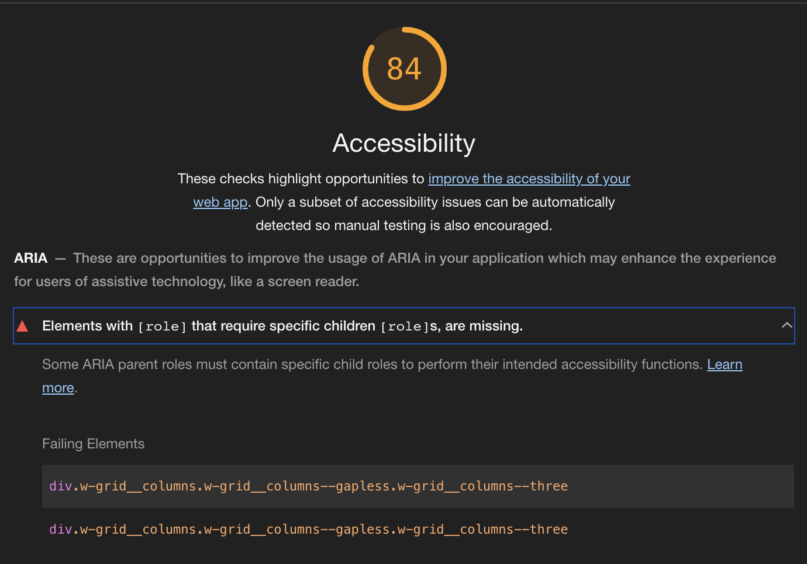
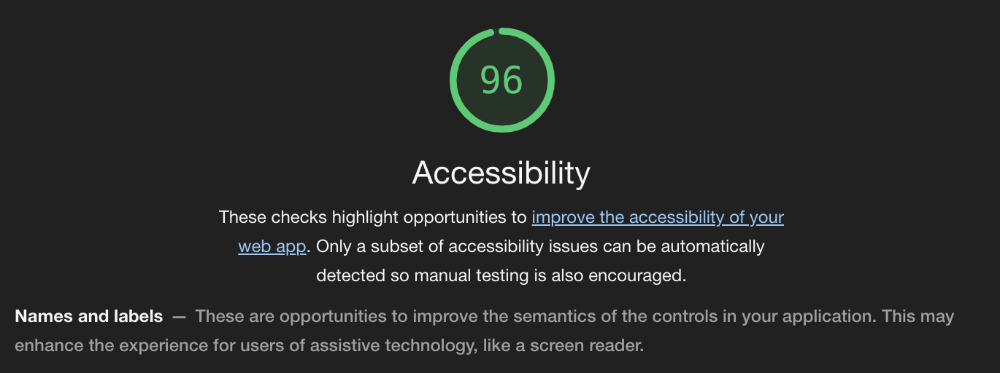

웹 페이지를 만들거나 운영하다 보면 하나부터 열까지 다 직접 문들기 떄문에 무엇을 만들지 뺄지 광장히 자유롭게 설정할 수 있다. 그래서 맘에 안들면 바꾸면 된다. 이번에는 내 맘대로 바꾸는 것이 아니라 [Lighthouse](https://developers.google.com/web/tools/lighthouse/?hl=ko)라는 도구로 검출 된 내용을 내 웹 페이지에 반영해보려고 한다.


이 글을 읽는 살마들은 아마 웹 접근성이나 성능에 관심이 많은 사람일 것이라 생각한다. 내 웹 페이지가 접근하기 쉬운지 어려운지, 어렵다면 어떻게 하면 쉽게 만들 수 있는지 분석해주는 툴이 바로 [Lighthouse](https://developers.google.com/web/tools/lighthouse/?hl=ko)이다.


## Lighthouse 로 네 웹페이지 측정해보기




혹시 Lighthouse를 처음 접하거나 사용해본적이 없는 사람들을 위해 간단한 사용법을 적어두었다.
1번 혹은 2번은 내가 원할 떄 브라우저에서 바로 보거나 주소를 입력해서 타 사이트를 분석해 볼때 유용하게 사용할 수 있다.
1. 크롬에서 내 웹 페이지 접속 > 개발자 도구 > Audit 탭 선택 > 분석
2. web.dev 접속 > Measure 메뉴 > 내 웹 페이지 주소 입력
3. 크롬 웹스토어에서 [Lighthouse](https://chrome.google.com/webstore/detail/lighthouse/blipmdconlkpinefehnmjammfjpmpbjk?hl=ko) 설치
4. 웹 페이지를 빌드 과정에 통합하기: [Lighthouse CI](https://github.com/GoogleChrome/lighthouse-ci/blob/master/docs/getting-started.md)


이 사진은 내 홈페이지인 [YUNHA Industries](https://llighter.github.io/) 사이트를 크롬에서 Lighthouse로 분석한 결과이다.
영어로 써있는데 내용은 `[role]`을 사용하는 요소는 그에 해당하는 하위 `[role]`을 가지고 있어야 한다는 것이다.

예를 들어 여러 개의 탭을 표현하는 요소가 있다면 그 안에는 각 탭들이 있을 것이다. 
아래 코드를 보면 `div` 태그에 `role="tablist"`이 들어가 있다. 그래서 하위 요소인 `button`에 `role="tab"`을 넣어준 것을 볼 수 있다.

```html
<div role="tablist">
	<button role="tab" aria-selected="true" aria-controls="tab-1-pane" active>
		Tab 1
	</button>
	<button role="tab" aria-selected="false" tabindex="-1" aria-controls="tab-2-pane">
		Tab 2
	</button>
	<button role="tab" aria-selected="false" tabindex="-1" aria-controls="tab-3-pane">
		Tab 3
	</button>
</div>
```

## 내 홈페이지에 적용하기

이제 실제 내 홈페이지 코드를 살펴보자. 나는 내 글들을 표현할 때 카드 형식을 쓰는데 여러 카드를 둘러싸는 태그에 `role="list"`를 넣어주었다.
하지만 하위 카드 요소에 `role`이 지정되어 있지 않아서 `role="listitem"`을 추가해 주었다.

```html/1,2
<div class="w-grid w-pb--std">
    <div class="w-grid__columns w-grid__columns--gapless w-grid__columns--three" role="list">
    <a href="${url}" class="w-card" role="listitem">
        <article class="w-post-card">
        <div
            class="w-post-card__cover ${thumbnail &&
            `w-post-card__cover--with-image`}"
        >
            ${thumbnail && renderThumbnail(url, thumbnail, alt)}
            <h2
            class="${thumbnail
                ? `w-post-card__headline--with-image`
                : `w-post-card__headline`}"
            >
            ${md(data.title)}
            </h2>
        </div>
        <div class="w-post-card__desc">
            <p class="w-post-card__subhead">
            ${md(data.subhead)}
            </p>
        </div>
        </article>
    </a>

    ...

    </div>
</div>
```

수정후에 다시 Lighthouse를 측정한 결과는 만족스로웠다.



## 정리하며..

이상으로 웹 접근성 향상을 위해 `role`을 어떻게 사용하지 알아보았다. 사실 **ARIA**는 일반 사용들이 체감하기 어려운 부분일 수 있지만 맹인, 문맹 혹은 학습장애가 있는 사람들에게 유용한 보조 기술로 제공하는데 중요한 역할을 한다. 뿐만 아니라 웹이 모니터나 모바일 등 화면에 머무르는게 아니라 구글 어시스턴트나 시리와 같은 음성 기술과도 결합하여 사용되기 떄문에 이러한 접근성을 고려하여 웹 페이지를 설계하는 것은 중요하다. 지금은 `role`에 대한 것만 수정하였지만 차츰 **ARIA**에 대한 부분을 반영하여 웹 페이지의 접근성을 향상시켜 가야겠다.

## 참고 자료들

* [Elements with an ARIA [role] that require children to contain a specific [role] are missing some or all of those required children - web.dev](https://web.dev/aria-required-children/)
* [W3C ARIA 스펙](https://www.w3.org/TR/wai-aria/)
* [ARIA - MDN  web docs](https://developer.mozilla.org/ko/docs/Web/Accessibility/ARIA)
* [ARIA 소개 - developer google](https://developers.google.com/web/fundamentals/accessibility/semantics-aria/)
* [Screen reader](https://en.wikipedia.org/wiki/Screen_reader)


<a href="https://pixabay.com/ko/?utm_source=link-attribution&amp;utm_medium=referral&amp;utm_campaign=image&amp;utm_content=1732539">메인 이미지는 Pixabay</a>로부터 받은 <a href="https://pixabay.com/ko/users/Anemone123-2637160/?utm_source=link-attribution&amp;utm_medium=referral&amp;utm_campaign=image&amp;utm_content=1732539">Anemone123</a>님의 이미지 입니다.


