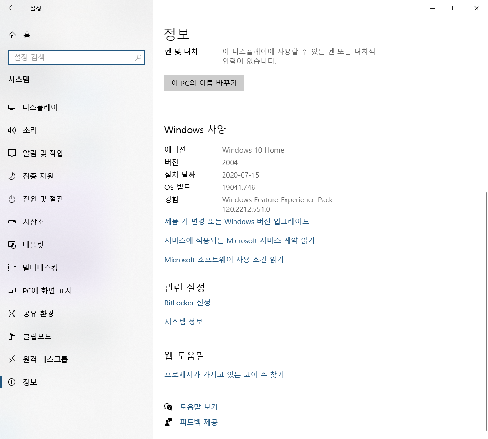

지금부터 [Windows 10에 Linux용 Windows 하위 시스템 설치 가이드](https://docs.microsoft.com/ko-kr/windows/wsl/install-win10)를 참고하여 내 윈도우 시스템에 리눅스를 설치해보겠다. 윈도우에 리눅스를 설치해서 사용하려는 이유는 여러가지가 있겠지만 나의 경우는 Windows 10 환경에서 개발을 할 때 설치파일 관리, 경로 설정 등 부가적으로 관리해줘야 하는 요소들이 많아져서 불편함이 많았다. 이를 해결하면서 윈도우에서 터미널을 꾸며 사용하고 싶어서 설치를 하게 되었다.


자신의 윈도우에 WSL2가 이미 설치되어 있거나 이 포스트를 통해 설치한 사용자는 [윈도우 터미널에 ZSH 설치하기]()를 통해 터미널을 자신에 맞게 멋지게 바꿔보는걸 추천한다.


## WSL2 수동설치 진행하기

[설치 가이드](https://docs.microsoft.com/ko-kr/windows/wsl/install-win10)에서도 나와있는 것처럼 설치 방법에는 자동설치와 수동설치 둘 중 하나를 선택하여 진행할 수 있는데 앞의 것의 경우  간편하지만 [Windows 참가자 프로그램](https://support.microsoft.com/ko-kr/windows/windows-%EC%B0%B8%EA%B0%80%EC%9E%90-%ED%94%84%EB%A1%9C%EA%B7%B8%EB%9E%A8%EC%97%90-%EC%B0%B8%EC%97%AC%ED%95%98%EA%B8%B0-ef20bb3d-40f4-20cc-ba3c-a72c844b563c)에 등록해야하고 특정 빌드 이상으로 업그레이드를 해야하기 때문에 수동 설치로 진행하기로 했다.

### 1단계 - Linux용 Windows 하위 시스템 사용

우선 WSL2를 사용할 수 있도록 설정해주기 위해 터미널을 **관리자 권한으로 실행** 으로 열어준다.



나는 [windows 터미널](https://docs.microsoft.com/ko-kr/windows/terminal/)을 통해 [PowerShell](https://docs.microsoft.com/ko-kr/powershell/)을 실행 시켰는데 아직 windows 터미널이 설치되어 있지 않다면 바로 PowerShell을 관리자 권한으로 실행시키면 된다.


이제 아래 명령어를 통해 **Linux용 Windows 하위 시스템** 옵션 기능을 사용하도록 설정해보자.

```powershell
dism.exe /online /enable-feature /featurename:Microsoft-Windows-Subsystem-Linux /all /norestart
```


### 2단계 - WSL 2 실행을 위한 요구 사항 확인

일반적인 윈도우 PC(x64 시스템)의 경우: **버전 1903** 이상, **빌드 18362** 이상에서 WSL2를 설치할 수 있다. 자신의 PC가 이 버전보다 위인지 확인해보자.


버전 및 빌드 번호를 확인하려면 Windows 로고 키 + R 을 선택하고, winver 를 입력하고, 확인한다.




### 3단계 - Virtual Machine 기능 사용

자 이제 설치하기 전 마지막 단계이다. **Virtual Machine 플랫폼** 옵션기능을 사용하도록 설정하자. 완료했으면 컴퓨터를 **재부팅** 한다.

```powershell
dism.exe /online /enable-feature /featurename:VirtualMachinePlatform /all /norestart
```


### 4단계 - Linux 커널 업데이트 패키지 다운로드

자 이제 [x64 머신용 최신 WSL2 Linux 커널 업데이트 패키지](https://wslstorestorage.blob.core.windows.net/wslblob/wsl_update_x64.msi)를 다운 받아보자. 이 링크는 [여기](https://docs.microsoft.com/ko-kr/windows/wsl/install-win10#step-4---download-the-linux-kernel-update-package)에서도 확인할 수 있다.

다운 받은 **wsl_update_x64.msi** 파일을 실행하여 설치를 진행한다.


### 5단계 - WSL 2를 기본 버전으로 설정

자 이제 다시 Posershell로 돌아가서 아래 명령어를 통해 WSL2를 기본버전으로 설정해준다.

```powershell
wsl --set-default-version 2
```


### 6단계 - 선택한 Linux 배포 설치

이제 준비는 끝났다. [Microsoft Store](https://aka.ms/wslstore)에서 자신이 원하는 리눅스 버전을 골라서 설치를 
진행하면 되는데 나는 가장 친숙한 Ubuntu를 선택하였다.


다운 받고 실행하면 [새 Linux 배포에 대한 사용자 계정 및 암호를 만들어야](https://docs.microsoft.com/ko-kr/windows/wsl/user-support) 한다.


계정 및 비밀번호를 설정해주면 끝이다. 추가적으로 처음 설치를 하면 패키지 관리자를 업데이트 해주는 것이 좋다.

```bash
sudo apt update && sudo apt upgrade
```

축하합니다. 이제 윈도우에서 **Cmd**를 벗어나 **터미널**로 개발을 시작할 수 있게 됐습니다. 윈도우에서 리눅스 라이프를 즐겨보도록 하죠. 


메인 사진은 <a href="https://unsplash.com/s/photos/terminal?utm_source=unsplash&amp;utm_medium=referral&amp;utm_content=creditCopyText">Unsplash</a>에서<a href="https://unsplash.com/@umityildirim?utm_source=unsplash&amp;utm_medium=referral&amp;utm_content=creditCopyText">Ümit Yıldırım</a>님이 제공한 사진입니다.