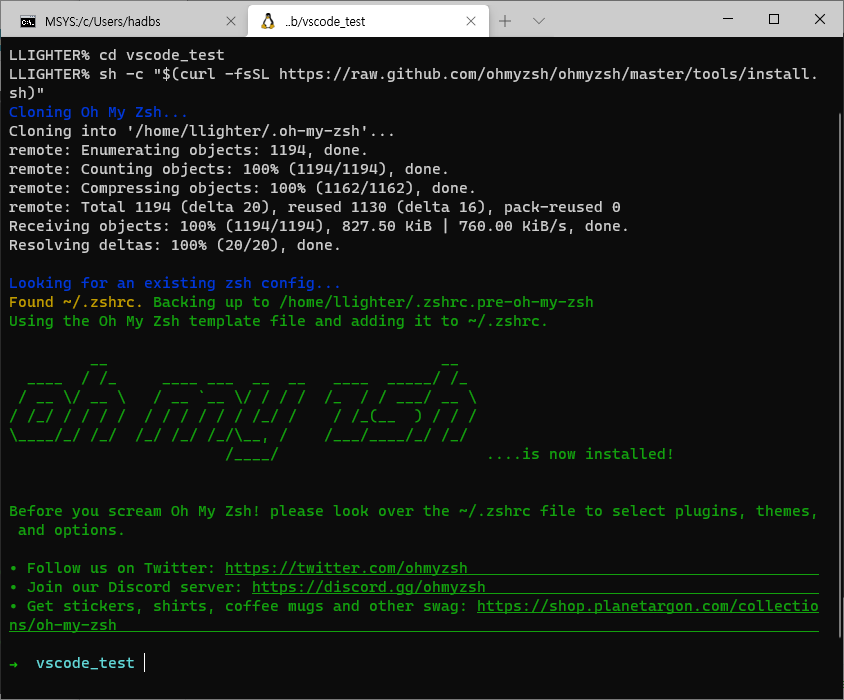

리눅스 환경이든 맥 환경이든 개발을 한다면 터미널을 선택이 아닌 필수이다. 4K 모니터에서 검은 배경에 흰 글자만 보고 있는 것보단 이왕이면 다양한 색상과 기능으로 편하고 즐겁게 개발을 하고자 한다면 **ZSH**을  선택해보자.

윈도우에서 WSL2를 통해 리눅스를 사용하던 일반적인 리눅스를 사용하던 처음 터미널 설정은 [Bash 쉘](https://ko.wikipedia.org/wiki/%EB%B0%B0%EC%8B%9C_(%EC%9C%A0%EB%8B%89%EC%8A%A4_%EC%85%B8))로 구성이 되어 있다. 우리는 쉘을 ZSH로 변경하고 커스터마이징을 할 수 있도록 [Oh my zsh](https://github.com/ohmyzsh/ohmyzsh)을 설치하고 각종 편의 기능들을 적용해볼 것이다.

## ZSH 설치

우분투 패키지 매니저인 [apt](https://ko.wikipedia.org/wiki/%EC%96%B4%EB%93%9C%EB%B0%B4%EC%8A%A4%ED%8A%B8_%ED%8C%A8%ED%82%A4%EC%A7%95_%ED%88%B4)를 이용하여 **ZSH**을 설치해보자.

```bash
sudo apt install zsh
```


### 기본 쉘을 ZSH로 변경

이제 ZSH이 설치되었으니 기본 쉘을 bash에서 Zsh로 변경해보자. `echo $SHELL` 명령어를 입력하면 현재 내 터미널에 세팅된 쉘이 무슨 쉘인지 확인할 수 있다.

```bash
chsh -s $(which zsh)
```


## Oh My Zsh 설치

이제 내 입맛에 맞게 터미널을 꾸미기 위해 [Oh my zsh](https://github.com/ohmyzsh/ohmyzsh)을 설치해보자. 설치 방법은 앞 링크에 자세히 나와 있고 나의 경우는 `curl`을 이용하여 설치했다.

```bash
sh -c "$(curl -fsSL https://raw.github.com/ohmyzsh/ohmyzsh/master/tools/install.sh)"
```




### powerlevel10k 설치

[powerlevel10k](https://github.com/romkatv/powerlevel10k)은 Zsh의 테마중 하나이다. 널리 쓰이면서도 유용한 정보를 적재적소에 제공해준다. 이 테마도 설치하는 방법이 여러가지가 있지만 우리는 방금 **Oh my zsh**을 설치했기 때문에 이를 이용하여 설치를 한다.

```bash
git clone --depth=1 https://github.com/romkatv/powerlevel10k.git ${ZSH_CUSTOM:-$HOME/.oh-my-zsh/custom}/themes/powerlevel10k
```


### Zsh에 테마 적용

자 이제 방금 받은 테마를 우리 쉘에 적용해보자. Zsh은 홈디렉토리에 설정파일은 가지고 있는데 이 파일을 수정해줘야 한다.

```bash
# 홈 디렉토리로 이동
cd ~

# 설정파일 오픈
vi ~/.zshrc
```

자 [vi](https://ko.wikipedia.org/wiki/Vi) 이용법에 대한 것은 인터넷에 좋은 자료가 많기 때문에 여기서는 필요한 부분만 간단히 설명하기로 하자.

처음 vi 에디터로 설정파일(`.zshrc`)을 열면 명령모드 상태일 것이다. 혹시 입력모드이면 `ESC` 키를 눌러서 명령모드로 빠져나오도록 하자. 이제 우리가 수정할 위치를 찾아서 입력모드로 수정한다음 저장을 할 것이다. 명령어는 아래와 같다.

1. `/ZSH_THEME` 입력 후 엔터
2. `i`로 입력모드로 변경 한 후 기존 입력 값을 `ZSH_THEME="powerlevel10k/powerlevel10k` 로 수정
3. `ESC`로 명령모드로 전환
4. `wq` 입력 후 엔터를 눌러 저장


자, 설정파일은 수정되었다. 설정은 자동으로 적용되지 않기 때문에 쉘을 재시작하거나 적용 명령어를 입력해줘야 한다.

```bash
source ~/.zshrc
```


적용후에는 각종 설정들을 보기 형태로 묻고 내가 선택한대로 세팅이 진행된다. 세팅을 선호의 영역이기 때문에 정답은 없다. 좋아 보이는 것을 따라가자.

아래는 내가 적용한 테마이다.


## 유용한 Zsh 플러그인들 설치

Zsh 안에서는 터미널을 편리하게 이용할 수 있는 여러 플러그인들을 설치할 수 있는데 여기서는 3가지 정도를 설치해보자.

### zsh-authsuggestions 설치

[zsh-authsuggestions](https://github.com/zsh-users/zsh-autosuggestions)은 내가 사용한 기록을 기반으로 입력값을 추천해주는 플러그인이다. 이 플러그인만 있다면 한번 입력한 명령어는 다시 찾아볼 일이 없다.

```bash
git clone https://github.com/zsh-users/zsh-autosuggestions ${ZSH_CUSTOM:-~/.oh-my-zsh/custom}/plugins/zsh-autosuggestions
```

적용 방법은 위에서 테마를 적용할 때와 같이 `.zshrc` 파일을 수정한 다음 적용하는 순으로 진행한다.

```bash
# 홈 디렉토리로 이동
cd ~

# 설정파일 오픈
vi ~/.zshrc
```

1. `/plugins` 입력 후 엔터
2. `i`로 입력모드로 변경 한 후 `plugins=(git zsh_autosuggestions)` 로 수정
3. `ESC`로 명령모드로 전환
4. `wq` 입력 후 엔터를 눌러 저장



2번에서 `plugins=(git zsh_autosuggestions)` 입력값을 아무것도 설치안했다면 `plugins=(git)` 이었을 것이다.
여기에 **zsh_autosuggestions** 문구만 추가해주면 된다.


설정을 적용해주자.

```bash
source ~/.zshrc
```

### zsh-syntax-highlighting 설치

자 이제 터미널을 다채롭게 해보자. 각종 명령어들을 색을 칠해 구분하게 해주고 틀린 명령어를 구분할 수 있게 해주는 [zsh-syntax-highlighting](https://github.com/zsh-users/zsh-syntax-highlighting) 플러그인 이다.

[설치 매뉴얼](https://github.com/zsh-users/zsh-syntax-highlighting/blob/master/INSTALL.md)을 따라 설치해보자.

```bash
git clone https://github.com/zsh-users/zsh-syntax-highlighting.git
echo "source ${(q-)PWD}/zsh-syntax-highlighting/zsh-syntax-highlighting.zsh" >> ${ZDOTDIR:-$HOME}/.zshrc
```

플러그인을 적용해보자.

```bash
source ./zsh-syntax-highlighting/zsh-syntax-highlighting.zsh
```

적용한 결과이다. 보기 편하지 않은가?


### zsh-z 설치

[zsh-z](https://github.com/agkozak/zsh-z)은 터미널에서 디렉토리를 이동할 때 편리한 플러그인이다. 여러번 입력했던 디렉토리를 기억해서 어느 위치에서건 최종 디렉토리 명을 `z some-directory`와 같이 입력하면 바로 이동할 수 있다.

```bash
git clone https://github.com/agkozak/zsh-z $ZSH_CUSTOM/plugins/zsh-z
```

```bash
# 홈 디렉토리로 이동
cd ~

# 설정파일 오픈
vi ~/.zshrc
```

적용 방법은 위에서 테마를 적용할 때와 같이 `.zshrc` 파일을 수정한 다음 적용하는 순으로 진행한다.

1. `/plugins` 입력 후 엔터
2. `i`로 입력모드로 변경 한 후 `plugins=(git zsh_autosuggestions z)` 로 수정
3. `ESC`로 명령모드로 전환
4. `wq` 입력 후 엔터를 눌러 저장

```bash
source ~/.zshrc
```


## Windows 터미널에서 색 구성표 적용하기

자, 여기까지 왔으면 기능상 기본적인 세팅은 모두 완료되었다. 마지막을 윈도우에서 할 수 있는 설정 하나 더 알려주며 이 포스트를 마친다.

[Windows 터미널의 색 구성표](https://docs.microsoft.com/ko-kr/windows/terminal/customize-settings/color-schemes)에서 보이는바와 같이 터미널에 색 구성표를 적용하여 여러가지 색을 적용할 수 있다. 난 **One Half Dark** 를 선택했다 아래와 같이 적용해주면 된다.



Windows 터미널에는 `alt`를 누르고 설정 단추를 선택하여 액세스할 수 있는 `defaults.json` 파일 내에 이러한 색 구성표가 포함되어 있습니다. 명령줄 프로필 중 하나에서 색 구성표를 설정하려면 색 구성표의 name을 값으로 사용하여 colorScheme 속성을 추가합니다.


## 정리하며...

이제 윈도우에서도 맥이나 리눅스에서와 같이 화려한 터미널 라이프를 즐길 수 있게 되었다. 터미널은 꾸미기 시작하면 끝이 없기 때문에 어느정도 세팅이 되었다 싶으면 사용하면서 하나하나 자기 자신에게 맞는 설정들을 추가해가는 것이 바람직하다. 나 또한 더 좋은 기능들이나 세팅이 있다면 여기에 업데이트 해두려고 한다.


메인 사진은 <a href="https://unsplash.com/s/photos/shell?utm_source=unsplash&amp;utm_medium=referral&amp;utm_content=creditCopyText">Unsplash</a>에서<a href="https://unsplash.com/@mattartz?utm_source=unsplash&amp;utm_medium=referral&amp;utm_content=creditCopyText">Matt Artz</a>님이 제공한 사진입니다.