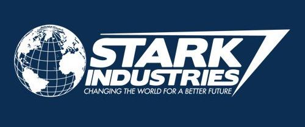
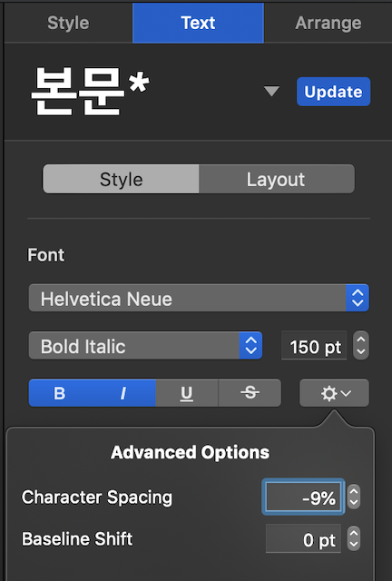
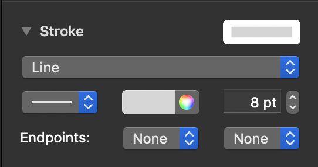
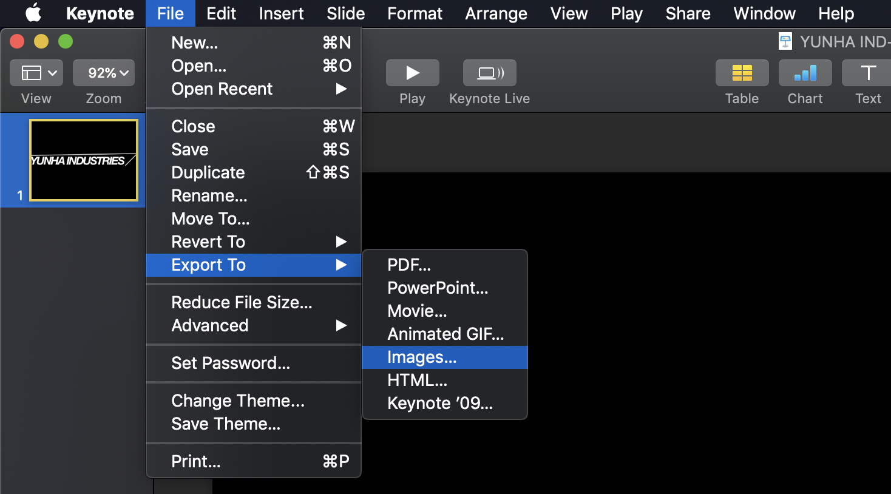
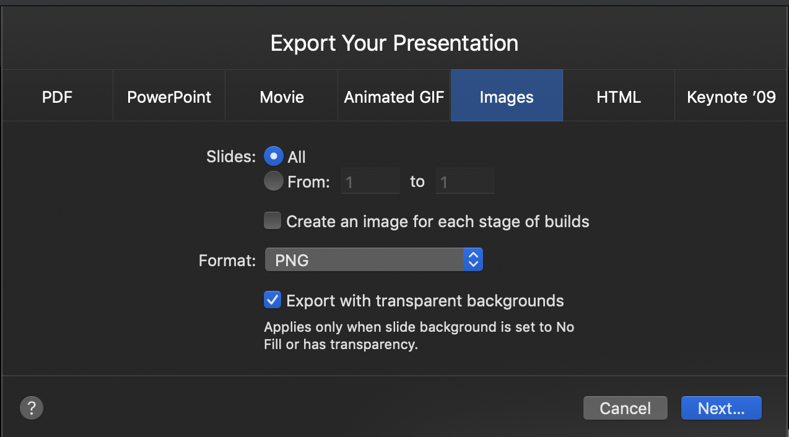
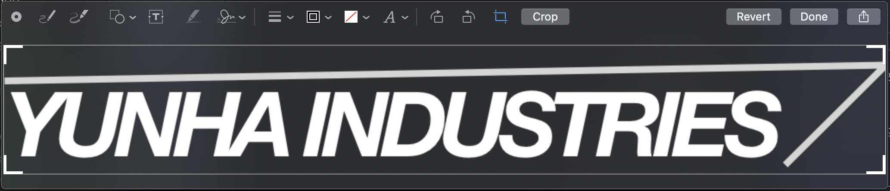
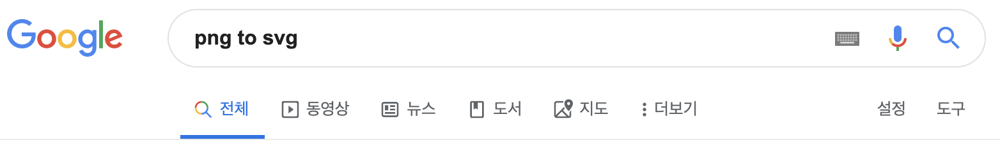
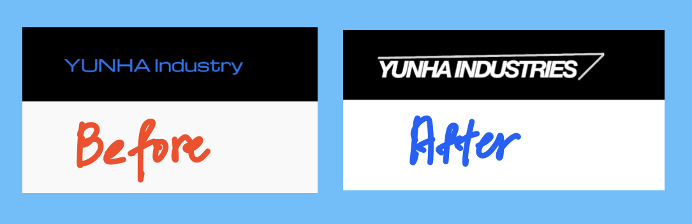

윈도우나 맥을 가지고 있지만 전문적인 디자인 툴을 이용해서 로고나 포스터를 만드는 일은 쉬운일이 아니다. 그런데 만들고 싶은 로고가 복잡하기 않다면 굳이 [포토샵](https://www.adobe.com/kr/products/photoshop.html)이나 [일러스트레이터](https://www.adobe.com/kr/products/illustrator.html) 같은 전문 툴을 사용해야할 필요가 있을까? 개인 홈페이지나 블로그 또는 작은 프로젝트를 진행하면서 간단하게 자신만의 로고를 만들어 사용해보자.

## Contents

1. 왜 키노트를 사용하는가?
2. 키노트로 로고 다자인하기
3. 배경없는 사진: PNG로 내보내기
4. 웹페이지에서 활용할 수 있도록 SVG로 변환하기
5. 홈페이지에 게시하기

## 왜 키노트를 사용하는가?

맥과 같이 비싼 장비를 보유하는 것의 장점중 하나는 수준 높은 도구들을 무료로 사용할 수 있다는 것이다. 그 중하나인 **키노트**는 발표자료를 작성하는데에도 주로 쓰이지만 문자와 디자인이 들어간 그림을 추출하는데에도 유용하게 사용할 수 있다.

키노트에는 각종 다양한 폰트, 도형, 미디어를 지원하여 간단한 로고를 만드는데 부족함이 없다. 거기에 **아이패드** 를 보유하고 있다면 마우스로 표현하지 못하는 그림도 **애플펜슬**로 표현할 수 있다.

## 키노트로 로고 디자인 하기

우선 나는 전문 디자인 역량이 없기 때문에 아이언맨의 토니 스타크가 운영하는 회사인 **스타크 인더스트리**를 오마주하여 로고를 디자인하였다. 



이 로고는 미국 군수업체인 록히드마틴 사의 로고를 패러디 한 것으로 단순한 글자와 선으로 이루어져 있다. 우선 디자인 시안? 이 나왔으므로 키노트를 열어보자.

### 폰트

폰트는 `Helvetica Neue`를 사용하였고 기본 자간(문자간격)이 넓기 때문에 **문자간격(Charater Spacing)** 을 `-9%`로 줄였다. 그리고 **볼드체**와 **이텔릭체**를 적용하여 비슷한 이미지를 구현하려고 했다. 




[문자간격 줄이기](https://support.apple.com/kb/PH24354?locale=ko_KR&viewlocale=ko_KR)를 사용하려면 수정하려는 텍스트를 선택하고 위와 같이 텍스트 탭을 선택 후 아래 톱니바퀴 모양을 클릭하면 문자간격을 조절할 수 있다.


### 도형

도형은 선 2개로 이루어져 있고 기본 선을 두께(`8pt`)와 색상(`white`)을 변경하여 표현하였다.



### 배경없이 사진으로 저장하기: `PNG`로 내보내기




로고로 사용하기 위해서는 로고 외 나머지 부분이 투명해야 한다. 키노트에서는 배경 옵션에서 채우지 않음을 선택하여 배경 색을 투명하게 하고 `파일` - `다음으로 내보내기` - `이미지…` - `포맷(PNG)` - `투명 배경을 포함하여 내보내기`를 선택한다.

## 웹페이지에서 활용하기 위해 로고를 `SVG` 형식으로 변환하기

우선, 내가 만드려는 로고는 홈페이지 상단에 넣은 로고이기 때문에 그에 맞도록 사진 높이를 조정해준다.



그런 다음 검색창에 `png to svg`라고 검색하고 맘에드는 사이트에 들어간다. 이 사이트는 일반 사진파일을 무료로 `SVG` 형식으로 변환해주는 사이트이다.




[SVG](https://ko.wikipedia.org/wiki/스케일러블_벡터_그래픽스)는 2차원 **백터 그래픽**을 표현하기 위한 파일 형식으로 다른 사진파일들과는 달리 확대하거나 줄여도 그림이 깨지지 않는다.


## 홈페이지에 게시하기

이제 만들어진 결과물을 내 홈페이지에 등록해보려고 한다. 기존의 로고는 너무 볼품이 없었다. 이 위치에 파일을 변경해보자.

```html
<section class="mdc-top-app-bar__section mdc-top-app-bar__section--align-start">
  <a href="#" class="material-icons mdc-top-app-bar__navigation-icon">menu</a>
  <span class="mdc-top-app-bar__title">
    <a href="/"></a>
  </span>
</section>
```



이상으로 키노트를 활용하여 로고를 만드는 방법에 대해 알아보았다. 디자인이 텍스트 위주이고 표현이 단순하다면 굳이 전문적인 툴을 사용하지 않고도 느낌있는 로고를 만들수 있을 것이다. 다만, 내용과는 별개로 자신만의 브랜드를 구축하고자 한다면 독창적인 로고를 만들어보는 것도 좋을 것 같다.
