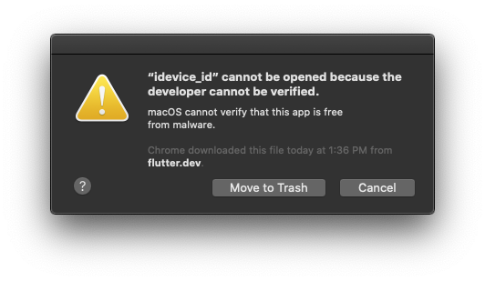
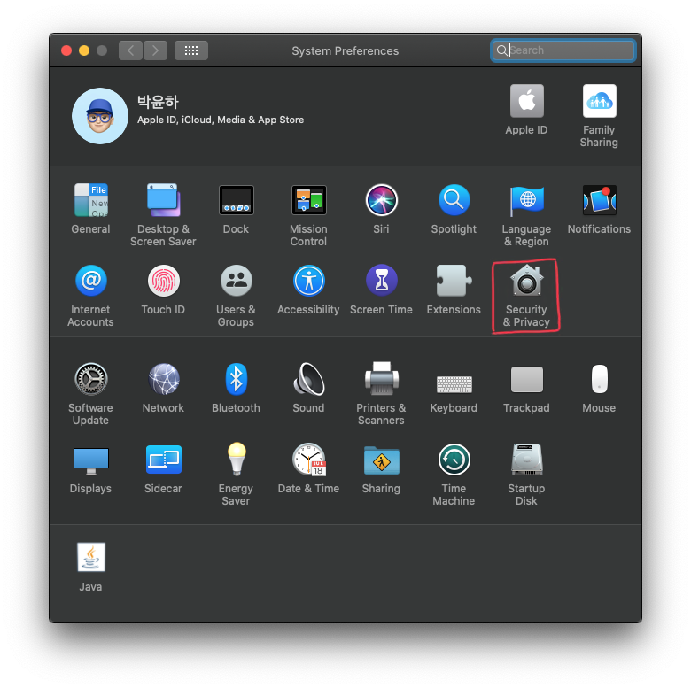
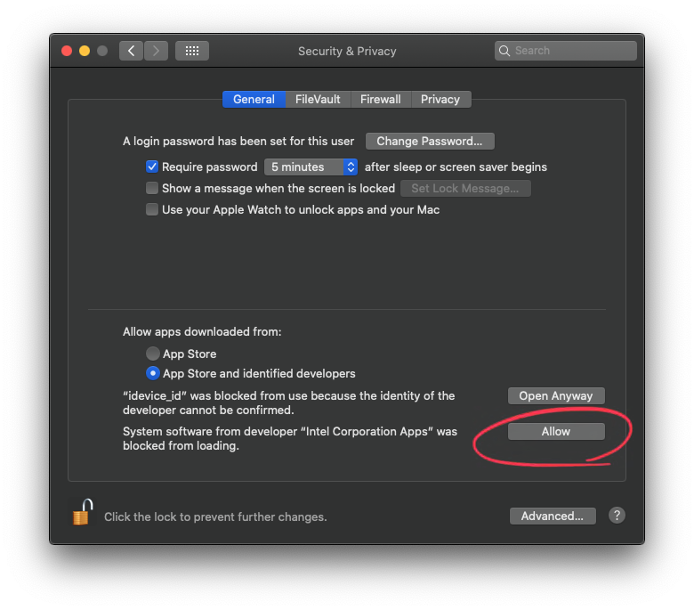

이 에러는 macOS 카탈리나를 올리고 플러터를 설치 후 터미널에서 명령어를 사용할 떄 나타난 에러이다. 무슨 문제인지 구글링을 해보니 10월 5일자로 [미디엄](https://medium.com/codespace69/flutter-idevice-id-cant-be-opened-because-its-integrity-cannot-be-verified-44ad2b313a0e)에 관련 글이 있어서 참고하여 해결하였다.

## TL; DR

### 개발 환경

- macOS Catalina 10.15
- Flutter 1.9.1+hotfix.4

### 빠른 해결 방안(How to solve problem)

- 터미널에서 `$ xattr -d com.apple.quarantine <app-path>` 실행
- **시스템 환경설정(System Preference)** > **보안(Security and Privacy)** > **idevice_id** 허용


 [xattr](https://blog.do9.kr/330) 명령은 파일이나 디렉토리에 속성 내용을 관리 할 수 있다.


## 언제 에러가 발생하는가?

카탈리나 환경에서 플러터를 설치하고 아이폰을 맥북에 연결하고 `flutter doctor`를 돌리니 아이폰은 인식하는 프로그램에서 보안 알림이 떳다. 그래서 실제로 아이폰이 연결되어 있지만 `no device`가 떳고 `flutter devices`에서도 마찬가지로 인식이 되지 않았다.

## 자세한 해결 방안(How to solve problem)

[VNBNews.vn](https://medium.com/codespace69/flutter-idevice-id-cant-be-opened-because-its-integrity-cannot-be-verified-44ad2b313a0e)이 언급한바에 따르면 `codesign`이 최근 인증이슈가 있어서 `xattr` 명령어로 quarantine(격리?) 속성을 제거해야 한다고 한다. 아래의 명령어를 실행한다.

`$ xattr -d com.apple.quarantine <app-path>`


 `<app-path>`는 **플러터-설치-경로/flutter/bin/cache/artifacts/libimobiledevice/idevice_id** 를 넣어주면 된다.


위 명령어를 입력하고도 다시 에러가 나면 보안 설정에 들어가서 **idevice_id** 를 허용해줘야 한다.


보안 설정에서 허용 버튼을 누르는 내용에 **idevice_id** 가 있으면 된다.


이제 `flutter doctor`를 실행해서 명령어가 정상적으로 수행될 것이다.

## 결론

써드 파티 앱(flutter)을 설치할 때 앱 허용 기준이 앱스토어에서 인증받은 개발자 설정되어 있는 경우 위에서 언급한 `codesign` 인증 이슈 때문에 에러가 나는 것 같다. 플러터가 아니더라도 앱스토어에서 내려받지 않고 플러터와 같이 압출파일을 내려받아 설차하는 경우 이런 에러가 나올 수 있을 것 같다. 그때에도 위와 같은 방식으로 해결하자.

