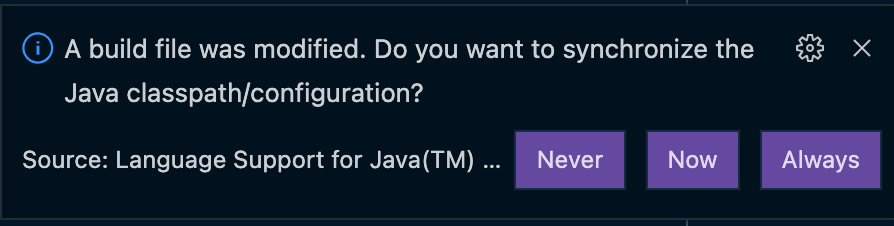
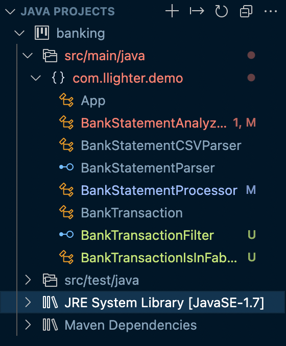
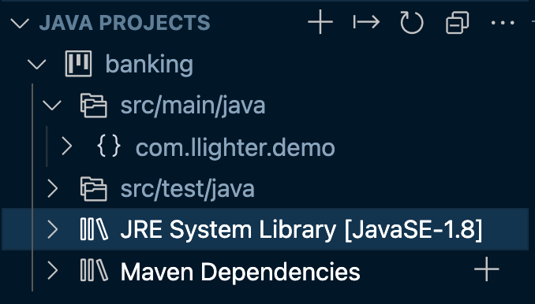

VS Code로 자바 개발환경을 구성하면서 빌드 툴로 메이븐을 사용하였다. 연습하는 자바 소스에는 람다를 활용하는 소스가 있었는데 아래와 같은 오류로 컴파일이 되지 않았다.

### `Lambda expressions are allowed only at source level 1.8 or above`

내 로컬 환경의 자바 버전은 11이었는데 위와 같은 메시지가 이해가 되지 않았지만 찾아보니 메이븐 컴파일러 자바 버전을 변경해줘야 했다.

메이븐 프로젝트 공식 문서에서 [Setting the -source and -target of the Java Compiler](https://maven.apache.org/plugins/maven-compiler-plugin/examples/set-compiler-source-and-target.html) 글을 보면 위 오류를 해결하는 두 가지 방법이 나온다. 나는 그중 첫번째 방법을 사용하였다.

### `Pom.xml` 변경하기

Java 8 언어 기능(`-source 1.8`)을 사용하고 컴파일된 클래스가 JVM 1.8(`-target 1.8`)과 호환 되도록 하려면 기본 속성인 아래 두 속성을 변경해줘야 한다. 기본값인 `1.7`에서 `1.8`로 변경해주었다.

```xml
<properties>
  <project.build.sourceEncoding>UTF-8</project.build.sourceEncoding>
  <maven.compiler.source>1.8</maven.compiler.source>
  <maven.compiler.target>1.8</maven.compiler.target>
</properties>
```

### 변경사항 적용하기

다른 IDE에서도 변경된 사항을 적용해주거나 프로젝트를 다시 열게 되면 변경사항이 적용될 것이다. VS Code에서는 변경사항을 자동으로 인식해 동기화를 할지 물어본다.



자바 프로젝트를 확인하면 기본값인 `1.7`에서 `1.8`로 변경된 것을 확인할 수 있다.





다시 소스로 돌아가보자. 이제 람다를 마음껏 활용할 수 있다.


