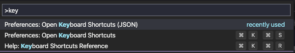
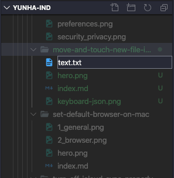

개발자 이거나 문서를 많이 작성하는 사람들에게는 효율성이 중요하다. 특히 단순한 작업을 할 떄는 동선을 최대한 줄이고 간단한 동작만으로 원하는 일을 처리해야 한다. 특히 **VS code** 와 같은 편집 툴에서는 파일을 생성하고 이름을 바꾸고 복사하고 붙여넣는 작업이 상시 이루어 지기 때문에 마우스나 터치패드를 이용하는 것은 효율적이지 못할 뿐만 아니라 매우 신경을 거슬리게 하는 작업이다. 따라서 이번 팁에서는 **VS code**에서 키보드 동작만으로 간단하게 파일을 제어하는 방법에 대해 알아보자.

VS code에는 크게 세 영역으로 화면이 나누어져 있는데 파일 트리를 볼 수 있는 익스플로러와 편집창 그리고 하단에 터미널이 있다. 사용자의 선호에 따라 그리고 상황에 따라 이 영역구분은 변하기는 하지만 일반적인 구성은 이 세 부분으로 나뉜다.

이 때 편집창에서 코드 혹은 문서를 작성하다가 새로운 파일을 만들거나 다른 파일을 찾는 경우에 기본적으로 팔렛트를 이용하거나 바로 파일 생성 단축키를 누르면 되지만 어떤 디렉토리의 목록을 보면서 파일을 선택하고 싶은 경우 익스플로러를 확인해야 한다.

### Explorer(⇧⌘E) 이동

위 단축키를 활용하면 커서의 포커스가 익스플로러로 이동한다.
여기서 디렉토리나 파일의 이름중 일부를 알고 있다면 바로 타이핑해서 검색할 수 있다.

### 파일 열기(⌘[ArrowDown])

커맨드와 방향키 아래를 누르면 파일을 열어서 편집창에서 확인할 수 있다.

### 이름 바꾸기(Enter)

디렉토리나 파일 위에서 엔터를 누르면 파일명을 변경 할 수 있다.

### 내가 이동한 위치에 파일 생성하기

이 기능을 사용하려면 키 설정을 추가해줘야 한다. 기본 설정만으로는 디렉토리가 지정되지 않고 생성되어 원하는 곳에 다시 저장해줘야하는 불편함이 있다.



위 사진과 같이 팔렛트를 열어서 키보드 단축키를 `JSON`파일로 입력할 수 있는 곳에 들어간다. 그 다음 아래 코드를 복사 붙여넣기 한 다음 저장하면 익스플로러에 포커스된 상태에서 `⌘` `n`을 입력하면 해당 디렉토리에 바로 파일을 생성할 수 있게 된다.

```json
{
    "key": "cmd+n",
    "command": "explorer.newFile",
    "when": "explorerViewletFocus"
}
```



위 사진을 보면 익스플로러에서 바로 파일을 생성하는 것을 확인 할 수 있다.

### 결론

**VS code**를 사용하면서 정말 좋은 편집기라는 생각이 들면서도 한편으로는 불편했던 점들이 있었다. 바로 오늘 내용 처럼 키보드로 바로 파일을 만들고 작성하는 것과 같은 문제들이다. 그럼에도 불구하고 **VS code**가 좋은 것은 사용자가 원하는 대로 설정하여 사용하는 것이 매우 자유롭다는 것이다. **VS code**의 활용도는 무궁무진하다. 앞으로 더 사용해가면서 소개하고 싶은 팁들이 있다면 더 소개하도록 하곘다.

### 참고

[VS code 단축키 레퍼런스 문서](https://code.visualstudio.com/docs/getstarted/keybindings)

썸네일에 사용된 아이콘은 <a href="https://www.flaticon.com/" title="Flaticon"> www.flaticon.com</a>의 <a href="https://www.flaticon.com/authors/freepik" title="Freepik">Freepik</a>님이 만드시 아이콘입니다.


