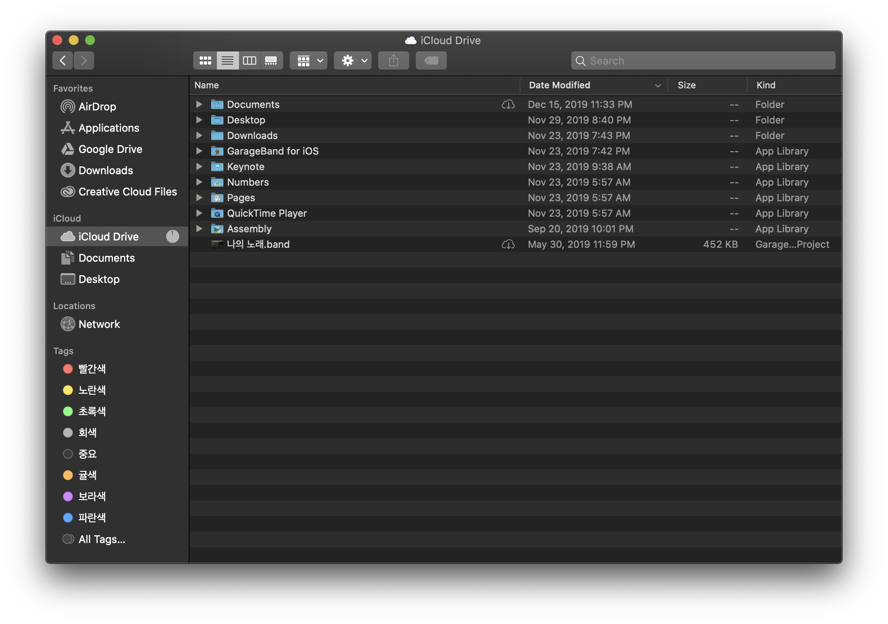
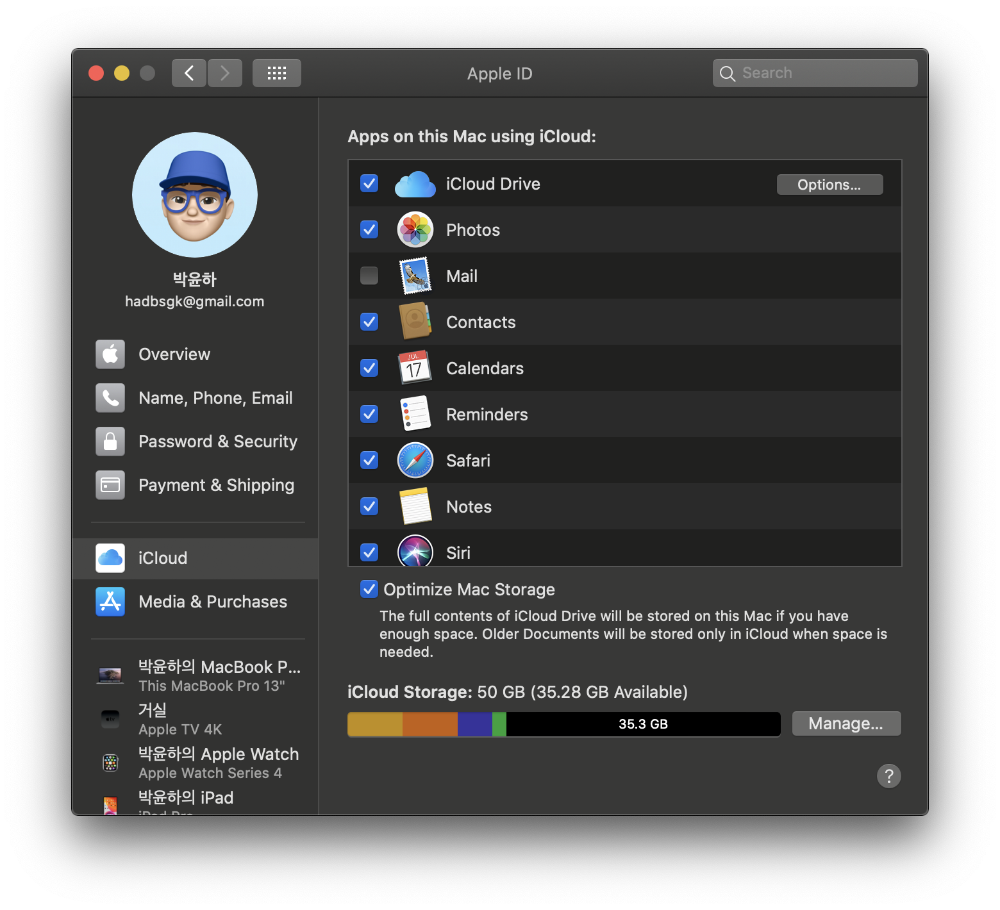
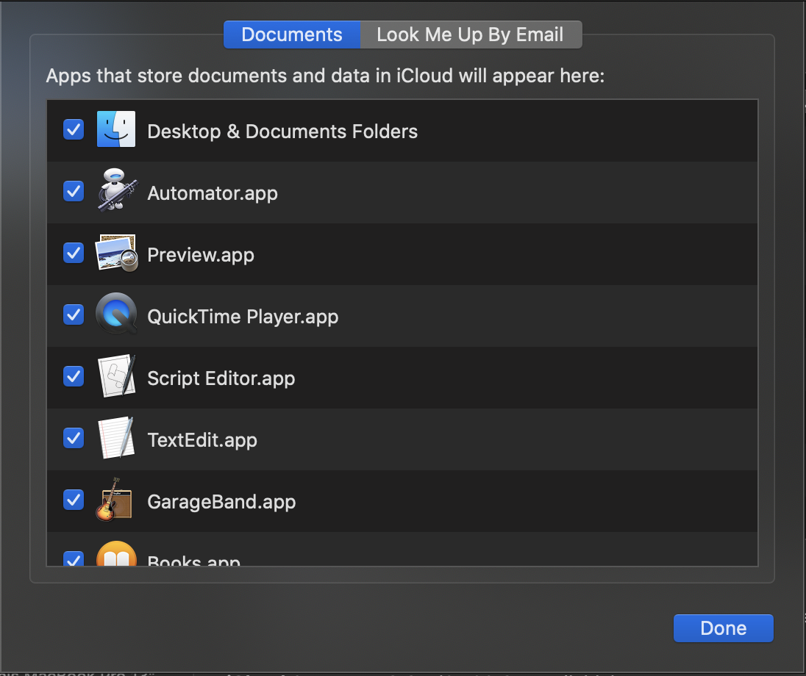
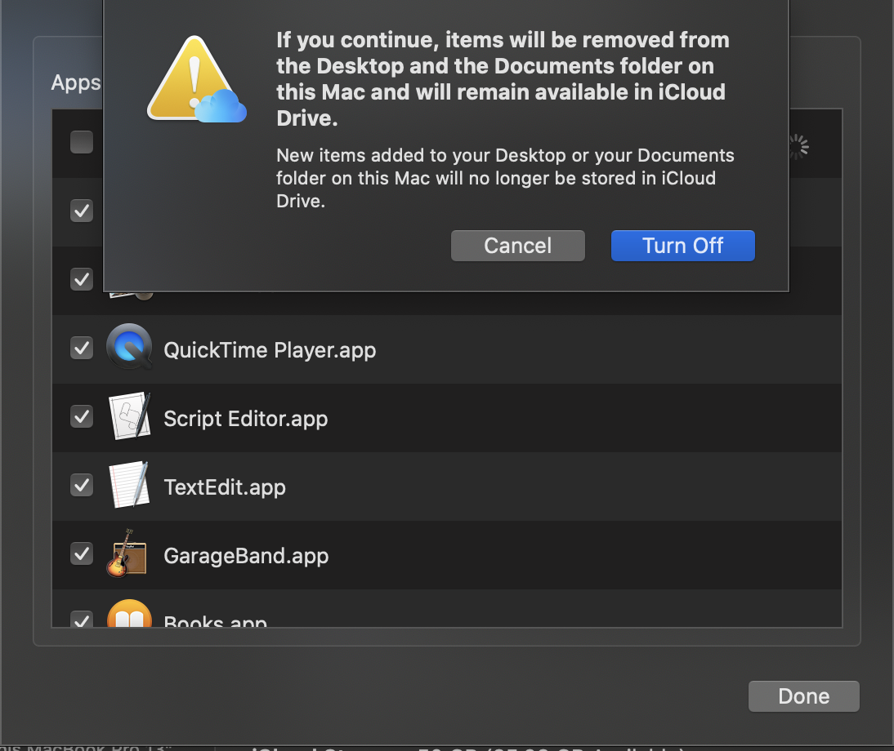
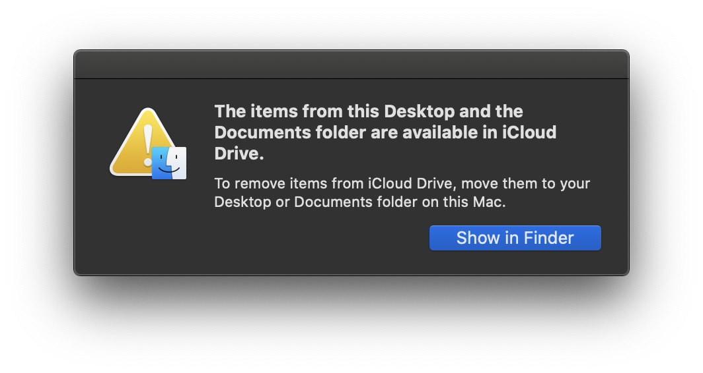

구글에 구글 드라이브가 있다면 애플에게는 아이클라우드가 있다. 아이클라우드로 사진, 파일, 메시지 등 많은 것들을 동기화 할 수 있는데 맥 같은 경우 데스크탑(바탕화면)이나 문서 폴더에 있는 파일들도 자동으로 동기화되어 있다. 

사람마다 차이가 있지만 보통 데스크탑 폴더에는 여러 잡다한 파일들이 많이 쌓이는 장소이다. 몇몇 사람들은 바탕화면에 모든 파일들을 관리하는 경우도 있다. 아이클라우드는 사용량에 제한이 있기 때문에 파일이 많아지고 용량이 커지면 관리를 해줘야 한다. 그래서 불필요한 동기화를 막기 위해 데스크탑과 문서 폴더의 동기화를 해제하는 방법에 대해 알아보자.

### 맥에서 아이클라우드 동기화 해제하기

우선 파인더를 열어보면 데스크탑과 문서가 아이클라우드에 포함되어 있는것을 볼 수 있다.
이제 **시스템 환경설정**에 들어가서 **Apple ID**에 들어가면 **iCloud**에 동기화중인 목록을 볼 수 있다. 그 다음에 **iClod Drives**에서 `options` 버튼을 누르면 세부적으로 폴더 및 앱에 대해서 설정할 수 있다.
우리가 할 일은 맨 위에 있는 **데스크탑과 문서** 폴더의 체크박스를 해제하는 것이다.

체크박스를 해제하면 경고창이 뜨는데 내용은 현재 데스크탑과 문서 폴더의 내용이 삭제된다는 것이다. 그리고 그 파일들은 **아이클라우드 드라이브**에서 사용가능하다는 내용이다.

따라서 당황하지 않고 확인을 누른 후 **파인더에서 보기**를 누르면 지워진 파일들을 확인 할 수 있다.

## 결론 

이제 이 파일들을 다시 데스크탑과 문서 폴더에 복사하면 동기화를 해제하면서 기존과 동일한 환경을 만들 수 있게 되었다.
무심코 동기화를 해제했다가 파일을 찾지 못하는 불상사가 없어지길 바라면서 팁 소개를 마치겠다.

메인에 사용한 사진은 <a href="https://pixabay.com/ko/?utm_source=link-attribution&amp;utm_medium=referral&amp;utm_campaign=image&amp;utm_content=3314296">Pixabay</a>에서 찾은 <a href="https://pixabay.com/ko/users/krzysztof-m-1363864/?utm_source=link-attribution&amp;utm_medium=referral&amp;utm_campaign=image&amp;utm_content=3314296">krzysztof-m</a>님의 이미지 입니다.

